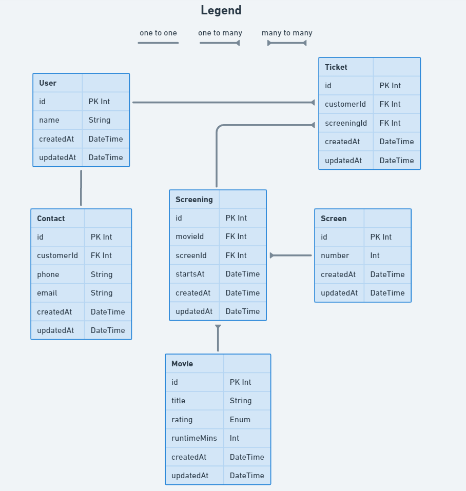

# Complete the ERD

So far, we've been working with the above ERD - it's almost complete!

Think about this user story:

> As a customer, \
  so I can watch a movie with my friends, \
  I want to book multiple seats with a single ticket

*Please note that by seat, we mean a physical seat within a screen room.*

Your task is to complete the diagram by adding a new model with the appropriate relationships. Add an image of your completed diagram to the project's root directory.
